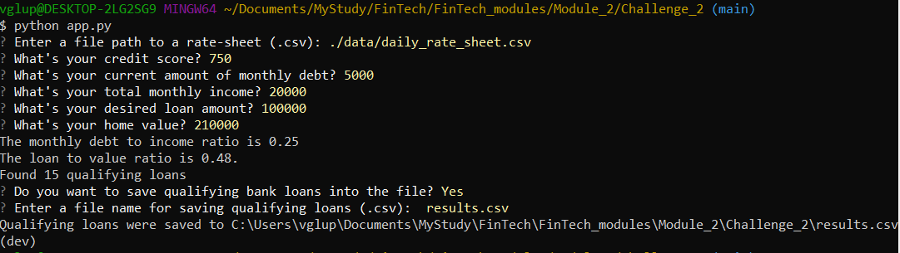

# Loan qualifier

The application helps to quickly and easily select loans suitable for the client. Based on provided information from the client and client's expectations about the loan, the application provides list of qualifying loans. The user can save results to file.

---

## Technologies

This project leverages python 3.7 with the following packages:

* [fire](https://github.com/google/python-fire) - For the command line interface, help page, and entrypoint.

* [questionary](https://github.com/tmbo/questionary) - For interactive user prompts and dialogs

---

## Installation Guide

> The application requeries installed Python! Please get it from [here](https://www.python.org)

Before running the application first install the following dependencies.

```python
  pip install fire
  pip install questionary
```
---

## Usage
To use the loan qualifier application please clone the repository and run the **app.py** with:

```python
python app.py
```
Further, as requests of the program arise, provide the following information:
* path to which contains loans
* credit score
* debt amount
* income
* loan amount
* home value

When processing of input date is done, the app will show you a number of qualifying loans.
User can save result to file by providing file name.

Here is an example of working application:




---

## Contributors

Vladislav Glupak - [Linkedin](https://www.linkedin.com/in/vladislav-glupak/)

---

## License

It is an Open-source app.
